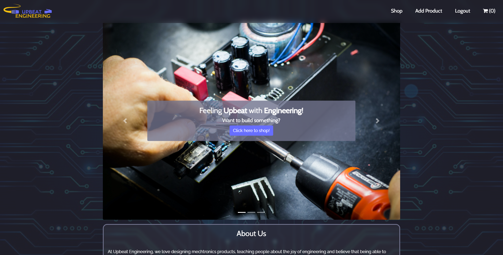
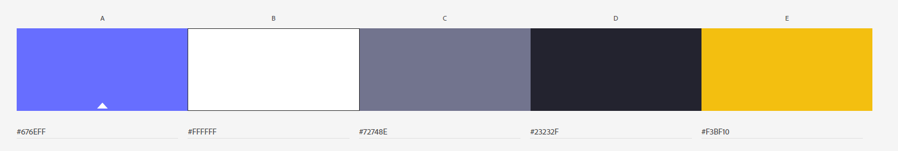
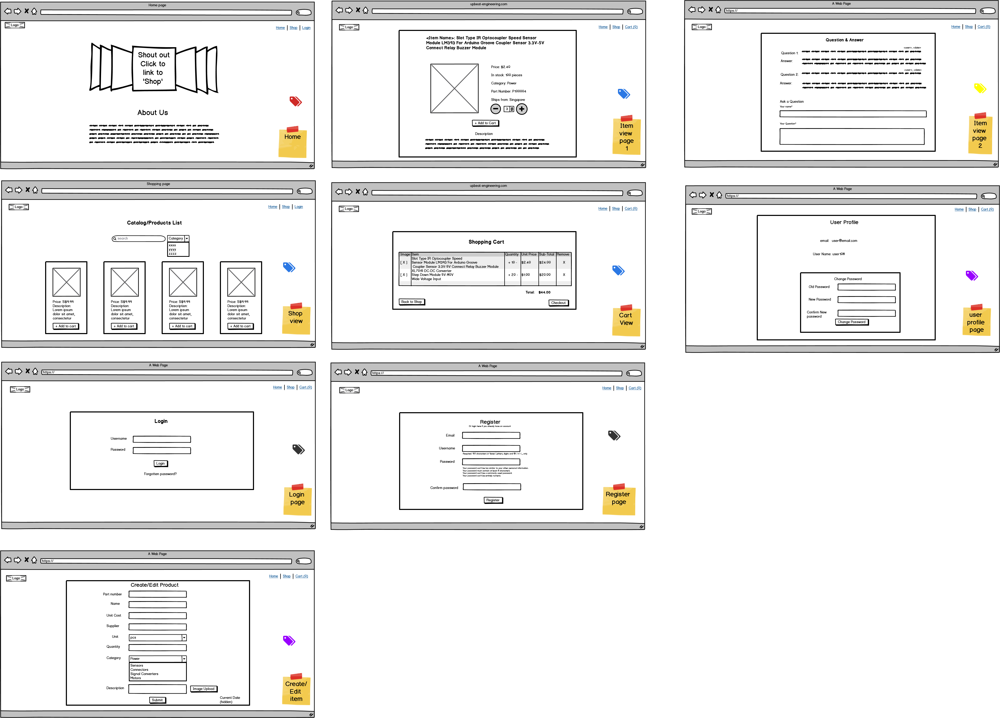
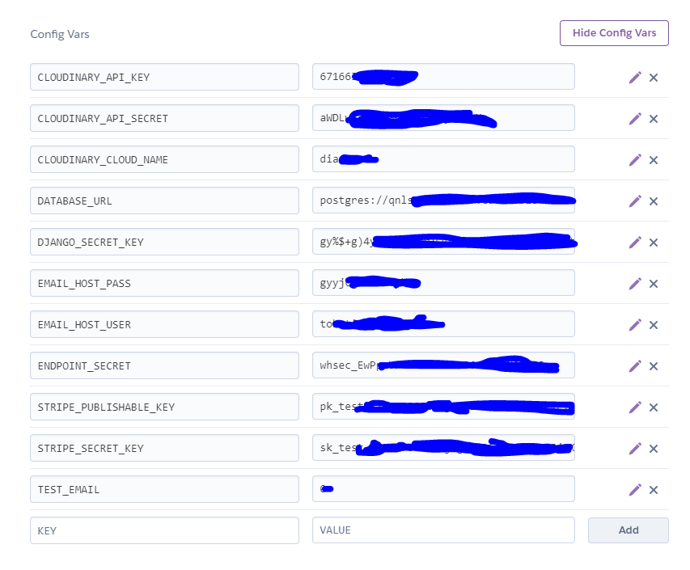

# Upbeat Engineering - Searching for electronic engineering components? Look no further.




## Overview

If you are someone who has interest in tinkering with mechatronics, want to make robots that can help you do things in life, yet know not where to get components.

Upbeat Engineering is here to help you. We offer sales of electronic components at affordable prices. We know that building electronics sometimes depends on inspiration and the 'feel' which may be lost if there is a delay or absence of the right parts. So we offer ourself as a swift source of components. Your order will reach you no later than 3 working days, right here in Singapore.

We are also looking to expand our services to product design and engineering kits for the youth education.

This project is deployed on Heroku [here](https://ci-ms4-upbeatengineering.herokuapp.com/).


### Objective

Upbeat Engineering is a based on a true concept from the developer's relative, a mechatronics enthusiast looking to expand his network of similar minded hobbyist by sharing his hardware and electronic parts (with a small fee). He knows by experience that building robots and devices do not move in a linear manner, resulting in spare parts and unused components, and sometimes a deterence to inspiration.

Parts and orders usually comes from overseas, with waiting time and a higher price. The purpose of Upbeat Engineering is to help like minded enthusiasts have a shorter lead time to getting what they need, so they can quickly get back on track with building.
  
---


## UX and UI

For this project, the frontend html was done first before proceeding to integrate with Django. The reason for this is to have an overview of the look and layout first before commencing work on the backend.

This website was conceptualized in discussion with a family member of the developer, who wished to do an online business related for sales of electronic engineering components and engineering design and solutions. 

The look of was based off this [site](https://hackaday.com/blog/), which is the family member indicated his preference. Based on this site's look, inspiration was sourced from [Pinterest](https://www.pinterest.com/), with the eventual decision to reference and adopt the theme of this [page](https://www.behance.net/gallery/62918019/GamingGear-E-commerce-Website).

The colour palette used is as follows:



Similar to the [reference site](https://www.behance.net/gallery/62918019/GamingGear-E-commerce-Website) mentioned above, the fonts of Gotham and [Cabin](https://fonts.google.com/specimen/Cabin) were adopted for this site. However, since Gotham is a paid font, [Raleway](https://fonts.google.com/specimen/Raleway) is used as a replacement, as listed on [this site](https://fontsplugin.com/google-fonts-gotham/).

Effort was made to source for suitable background images that relate to electronics and circuit boards, which are in-line with the theme of this page. Image sources came from [Pinterest](https://www.pinterest.com/), [Pexels](https://www.pexels.com/) and [Unsplash](https://unsplash.com/).


### User stories

As a potential buyer:

1. I want to be able to search by the component product name
2. I want to be able to search by component product type (sensor, motor, connectors, etc)
3. I want to see a more detailed component product description
4. I want to be able to see the list of products in a 'shopping cart'. I should be able to increase/decreae the quantity of products in my shopping cart, or remove the product, just like a physical shopping cart. 

As the shop owner:

1. I want to be able to add new products to my shop. 
2. I want to be able to remove old products from my shop.
3. I want toe be able to change the various product details (such as name, description, supplier, etc) when needed


### Wireframes and ER Diagrams

<details>
<summary>Wireframe</summary>

<p align="center">
    
</p>

</details>

<details>
<summary>ER Diagram</summary>

<p align="center">
    
</p>

</details>

The frontend individual webpages was done first before integration into Django backend. The reason for this was to have an overall view of the layout, appearance and 'feel' of the page flow.  

---

## Features

This site has 7 main features:

-  [Landing page](#)
-  [Products List](#)
-  [View Product](#)
-  [Shopping Cart](#)
-  [Add Product*](#)
-  [Update Product*](#)
-  [Delete Product*](#)

**Admin only*


### Landing Page

Upon visiting this site, the user is greeted with a landing page. This page has a carousel with various images of electonics hobbyist workshops and component. 

Clicking on the "Shop Now" button in the carousel brings the user to the *Product List* on the shop. 

Following is a short write up "About Us" which gives the background of this shop and the intent of the shop owners. 

On the navbar, there are the following links: 
- Logo: Leads back to the landing page
- Shop: Brings user to the products list page
- Login: Login screen for user
- Register: Registration page for user

Upon user login, the following links will appear:
- Logout: Logout page. This replaces login link.
- Cart: Shopping cart that shows products user wishes to purchase. 

Upon admin login, the navbar will display the following additional link:
- Add product: Leads the admin to the "add product" form.

*Notes on Feature Development:*

The images from for the carousel, mostly selected from [Unsplash](https://unsplash.com/) is based on the shop owner being an electronic engineering hobbyist, and aims to invoke a sense of interest in tinkering in engineering electronics.

Code Institute's walkthough of [Boutique Ado project](https://github.com/ckz8780/boutique_ado_v1) on the LMS was referenced to for the initial setting up steps on Django.

The navbar was made initially transparent. This was done by following the Steps on this [Stackoverflow post](https://stackoverflow.com/questions/16392952/css-to-make-bootstrap-navbar-transparent). 

Along the way, it was decided that a semi-transparent background will be better for the UX, since page elements will overlap with the contents inside a transparent navbar. AN attempt was made to do a 'frosted-glass background' by following [this site](https://codepen.io/GreggOD/pen/xLbboZ). However, this was eventually replaced with a simpler method by using the 'Backdrop-filter' CSS property. 

More on backdrop-filter can be found on [CSS-Tricks](https://css-tricks.com/the-backdrop-filter-css-property/) and [Mozilla.org](https://developer.mozilla.org/en-US/docs/Web/CSS/backdrop-filter). It is noted that this property may have some compatibilty issues with certain browsers.

Towards the end of the development process, there was a need to differentiate the features access between a superuser and a "normal login" user (for example a customer) on the navbar and throughout the site. 

This was accomplished via 2 portions: adding a  `@user_passes_test(lambda u: u.is_superuser)` for superuser and `@login_required` for normal login user before the respective `def` fuction in `views.py`, followed by if-else loops in the `template.html` with conditions: `` and/or ``

References to superuser only access was found on Stackoverflow [here](https://stackoverflow.com/questions/12003736/django-login-required-decorator-for-a-superuser) and [here](https://stackoverflow.com/questions/56897625/want-to-authenticate-only-superuser). Normal user - `@login required` was covered by the lecturer.


### Products List Page

On this page, the user can see all the products sold. Each  product's image thumbnail, name, price and category are arranged into cards for the user to preview. The user may only add the product to cart upon login. The user can also click on the product thumbnail to view it in detail. The user may also search for specific products by using the search function, which allows search by key words and/or category.

*Notes on Feature Development:* 

The display layout for the products list page and *Product page* was largely referenced from [Banggood Online Store](https://sea.banggood.com/search/single-pin.html?from=nav) and [Cytron.io](https://sg.cytron.io/p-encoder-sensor-module?src=search.instant), due to the similar nature of products sold. 

At the initial stage, Bootstrap code from [this site](https://getbootstrap.com/docs/4.5/examples/carousel/) was referenced for the individual product layout. Along the way, through discussion with classmates, decision was made to use [Bootstrap cards](https://getbootstrap.com/docs/4.0/components/card/) instead. [W3Schools](https://www.w3schools.com/bootstrap4/bootstrap_cards.asp) was referred to frequently for tutorial on Bootstrap cards usage. 

There was some issues with changing the background colour of the cards. A solution was found on [Stackoverflow](https://stackoverflow.com/questions/42430987/how-to-change-the-opacity-of-a-card-block-in-bootstrap-4). A way was also found to [fit the images nicely into the card](https://stackoverflow.com/questions/3029422/how-do-i-auto-resize-an-image-to-fit-a-div-container).


### View Product Page

This pages shows further information on the product, such as quantity in stock, part number and description.

The user may search for the desired product via typing in the product name, and selecting one of the six product types: Power, Sensors, Connectors, Signal Converters, Motors and Others.

The user may also add the product to the shopping cart from this page.


### Shopping Cart and checkout

The shopping cart shows the list of products the user intends to purchase. The product name, unit price, quantity of purchase and costs sub-total  are shown. A thumbnail of the product is shown as well. 

The user can increase or decrease the quantity by clicking on the "-" and "+" buttons. The "Sub-Total" updates according to the quantity. If the user changes his mind, he may also click on the "thrash" icon to remove it from the cart.

The total costs at the bottom right is also updated accordingly.

Once the user has finished shopping, he can click on the "Checkout" button to proceed with checkout on Stripe.

*Notes on Feature Development:* 

During the initial stage of development, the cart contents could not be displayed. To investigate, the `cart` contents stored in session storage was printed to console via `print(cart)`, these were then passed to a [python dictionary beautifier](https://codebeautify.org/python-formatter-beautifier). It was eventually discovered that this issue was due to pointing to the wrong dictionary keys. A sample of the code below:

```python
def view_cart(request)
  cart = request.session.get('shopping_cart', {})
  print(cart)
```

There were also rounding errors for the values of 'sub-total' and 'total'. An explanation and possible [solution](https://stackoverflow.com/questions/2569015/django-floatfield-or-decimalfield-for-currency) to handle this error was to use `DecimalField` instead of `FloatField`. 
However, this causes Stripe to give an "Integer Error". Upon consulting [Stripe documentation](https://stripe.com/docs/currencies), it became clear that Stripe works with integer values only. Hence after discussion with the lecturer, a workaround is to use `IntegerField` for the cost price, and divide by 100 to properly display in dollars. 

The division by 100 was done in the `template.html` by [using mathfilters](https://stackoverflow.com/questions/5848967/django-how-to-do-calculation-inside-the-template-html-page), with adjustments to [display 2 decimal places]((https://stackoverflow.com/questions/12903686/how-can-i-get-a-decimal-field-to-show-more-decimal-places-in-a-template). The installation steps for mathfilters can be found [here](https://pypi.org/project/django-mathfilters/).

At the final step, after checkout and payment, Stripe Webhooks failed due to `HTTP status code 401 (Unauthorized)`. After looking at the [stripe documentation](https://stripe.com/docs/error-handling) and piecing the facts together, it was deduced this occured due to port 8080 being set as private in Gitpod. This issue was resolved after changing the setting to "Make Public".


### Add Product (Admin only)

An admin can access this page to add new products to the shop for sale. The following fields have to be populated: Name, Cost, Unit, Quantity, Category, Part Number, Description, Supplier and Cover (image upload). This function is accessed from the Navbar.

*Notes on Feature Development:* 

Significant time and effort was spent troubleshooting the [Cloudinary](https://cloudinary.com/) image upload function via HTML template pages. Initially, when this was done, the image identifier link failed to be captured - means to say the image field is actually empty. The "Uploading..."  and "Done!" messages did not work as well. What was puzzling was that everything worked fine when image upload is done via Django backend. 

Due to sparse information on troubleshooting Cloudinary issues, this developer resorted to scrutinising the JavaScript and the image upload HTML `<form>` elements for code discrepancies. Thorough comparision was done with the JavaScript and HTML in the [Django Cloudinary Sample](https://github.com/cloudinary/cloudinary-django-sample/blob/master/photo_album/templates/upload.html#L87), with the help of an [Online JS Beautifier](https://beautifier.io/). 

Eventually, with the help of [this article](https://medium.com/@szczerbeansky/django-web-app-and-images-cloudinary-straightforward-study-ae8b5bb03e37), one of the cause for errors was identified - the missing `enctype="multipart/form-data"` for the `<form>` element. 

With the help of [TextCompare.org](https://www.textcompare.org/javascript/), another cause was identified, where the "#id" and ".class" of the HTML and JavaScript did not match, leading to the "Uploading...", etc messages failing to update. 

Through discussions with classmates (some who also faced the same issue), the final and most important cause was finally resolved: `fields = ('cover')` was missing from the Forms Model! Classmates who did not face this issue used `fields = ('__all__')`, hence circumventing it altogether. A sample of the corrected `ProductForm` model is appended: 

```python
class ProductForm(forms.ModelForm):
    cover = CloudinaryJsFileField()

    class Meta:
        model = Product
        fields = ('name', 'cost', 'unit', 'quantity',
                  'category', 'part_number', 'description',
                  'supplier', 'cover')
        # fields = ('cover') was missing the whole time!
```

Much time was spent scrutinising and attempting to debug the frontend code as this developer wrongly assumed that there was no issue with the backend code (due to successful upload with Django backend).

Sometimes, the answer is just right under our nose. It is when one is able to not hold on too strongly to one's close-minded fixations, that there is space for the solution to surface in one's mind. This was a valuable lesson learnt not just in coding, but also to life. 


### Update Product (Admin only)

If the admin wishes to update the product details, he can do so. This function is accessed from the *Product List* page. 


### Delete Product (Admin only)

The admin may also choose to remove the product if needed. This function is also accessed from the *Product List* page. 


*Notes on development for Add/Update/Delete Product:* 
  
Django messages were used to provide feedback and inform the user upon the completion of these functions. These site were referred to for understanding the Django messages framework and working with Django messages:

- [The messages framework](https://docs.djangoproject.com/en/3.1/ref/contrib/messages/)
- [Message Levels and Tags](https://simpleisbetterthancomplex.com/tips/2016/09/06/django-tip-14-messages-framework.html)

Django messages was used in conjunction with [Toastr](https://github.com/CodeSeven/toastr). This was done with help from [this article](https://stackoverflow.com/questions/45004245/how-to-use-toastr-in-django-for-success-or-fail-message) in Stackoverflow. Point to note that the JavaScript syntax for toastr in Django templates differs slightly from that used in Flask templates. 


### Features Left to Implement
 
 1. Feedback to user, either in the form of pop-ups, redirection to a new page, or Django Messages upon the following events:
    - Checkout successful
    - Purchase completion: e.g. "Thank you for your purchase."
    - Checkout cancelled

2. HTTP 404 and HTTP 500 pages, in the event of invalid page or server errors

3. Displaying "Welcome \<Username\>!" at the navbar after user login

4. Adding CSS and layout for the following pages: 
   - Reset password
   - Verify email 
   - Confirm email  

5. Adding notes for the requirements of the username and password at the user registration page, for example: 
   - Minimum length of username and password
   - Accepted/Unaccepted characters (e.g. *&!%)

6. Update Username and Registered Email pages.

7. Instructions to user on filling of forms for adding/updating product, for example:
    - Input product cost in cents
    - Character limits for each field

8. Catering for price of up to 3 decimal places, for e.g $2.437. Currently only prices up to 2 decimals are used for this project.

9. Customise form fields display in the Add Product form,  for uniqueness. Currently the standard display is used.

10. User friendly display of long product descriptions in the View Product page. 

11. On the View Product page, updating of the product quantity before adding to the shopping cart. 

11. In the shopping cart, display an input field for the user to directly input desired quantity. 
    - User may wish to buy in large quantities, in which keying in is faster that clicking on the "+" icon multiple times. 

12. Admin CRUD functions for product Supplier and Category

13. Udpdate the quantity in stock accordingly when purchases are made

14. A Q&A feature for users to post questions on products

---

## Technologies Used

1.  [HTML](https://developer.mozilla.org/en-US/docs/Learn/Getting_started_with_the_web/HTML_basics) to display contents in browser

2.  [CSS](https://developer.mozilla.org/en-US/docs/Learn/Getting_started_with_the_web/CSS_basics) page styling customisatoin

3.  [JavaScript](https://en.wikipedia.org/wiki/JavaScript) for DOM manipulation and user element interaction

4.  [bootstrap](https://getbootstrap.com/) for the frontend development

5.  [Fontawesome](https://www.bootstrapcdn.com/fontawesome/) iconsets for buttons

6.  [Gitpod](https://www.gitpod.io/) online cloud develop environment

7.  [Python](https://www.python.org/) as the backend development language

8.  [Django](https://www.djangoproject.com/) web framework

9.  [SQLite3](https://www.sqlite.org/index.html) database used for development phase with Django

10.  [Heroku](https://www.heroku.com/) for cloud platform deplpyment

11.  [PostgreSQL](https://www.postgresql.org/) database after deployment to Heroku

12.  [Cloudinary](https://cloudinary.com/) for storing online images

13.  [toastr](https://github.com/CodeSeven/toastr) for flash messages

14.  [ERDplus](https://erdplus.com/) to draw ER Diagrams and Relationship Schema

15.  [Balsamiq](https://balsamiq.com/wireframes/desktop/) for wireframes
 
---
 

## Testing

Manual testing was done on all links and Pages.

Test cases are for Shopper (User) and Admin (Superuser).

User type | Username | Password
-|-|-
Shopper (User) | testtest | rotiprata123
Admin (Superuser) | admin | rotiprata123


### Testing for Shopper (User)

<details>
<summary>Shopper Test Steps</summary>

No. | Test Case | Expected Result(s) | Results
-|-|-|-
1 | Click on the "Upbeat Engineering" icon at the top left of the page | User will be brought to the *Landing Page* | Pass
2 | Click on the "Login" button on the Navbar | User will be brought to the *Sign In* page | Pass
3 | Type in the login and password for "Shopper" as above, and click "Sign In" | User will be brought back to the *Landing Page* | Pass
4 | Click on "Click here to shop!" button in the carousel, or the "Shop" link on the navbar | User will be brought to the *Product List* page | Pass
5 | Search by text input only: Input desired search field in Search bar (for e.g. "converter"), and leave "Category' alone | Products fitting the search Criteria will be displayed | Pass
6 | Search by category only: Select "Power" for "Category' | Products of Category "Power" will be displayed | Pass
7 | Search by both text input and category: Input desired search field in Search bar (for e.g. "converter"). Select "Power" for "Category' | Products with words "converter" under Category "Power" will be displayed | Pass
8 | Click on "Add to cart button" button | Message "Product added to cart" will be shown. Cart icon turns from (0) to (1) | Pass
9 | Click on an image of a different product | User will be brought to the *View Product Page* | Pass
10 | On *View Product Page* click on "Add to cart button" button | Message "Product added to cart" will be shown. Cart icon turns from (1) to (2). User is routed back to *Product List* page | Pass
11 | Click on the cart icon on the navbar | User will be brought to the *Shopping Cart* page | Pass
12 | Click on "+" button, then the "-" button | Quantity, Sub-Total and Total prices will be updated respectively | Pass
13 | Click on the "trash" icon for a product | Product will be removed from cart | Pass
14 | Click on the "Checkout" button | User will be brought to Stripe payment page (Test Mode) with a summary of purchase payment | Pass
15 | Input "4242 4242 4242 4242" for *card information*, and a future date in the *expiry* field. Fill up the rest of the form accordingly, and click "Pay" | After successful payment, user is brought back to the *Landing Page*. | Pass
16 | Click on *Logout* on the navbar and click *Sign Out* | User is brought to *Sign Out* page, then the *Landing Page*. | Pass
  
</details>

### Testing for Admin (Superuser)

Most of the test steps listed here are unique to Superuser. The above tests for Shopper (User) should pass for the Superuser as well. 

For Step 4 "Add Product", the following suggested values can be inputted/selected:

- Name: A4988 Reprap Stepping Stepper Step Motor Driver Module

- Cost: 147

- Unit: pcs

- Quantity: 10

- Category: Motors

- Part Number: P100010

- Description: A4988 is a complete microstepping motor driver with built-in translator for easy operation. This product is available in full, half, 1/4, 1/8 and 1/16 step modes operate bipolar stepper motors, output drive capacity of up to 35 V and ? 2 A. A4988 includes a fixed off-time current regulator, the regulator in slow or mixed decay modes. A4988 converter is the key to the easy implementation. As long as the "step" input inputting one pulse drives the motor one microstep.

- Supplier: Lazada

- Cover: Upload any image, preferably of max size 300 KB

<details>
<summary>Admin Test Steps</summary>

No. | Test Case | Expected Result(s) | Results
-|-|-|-
1 | Click on the "Login" button on the Navbar | User will be brought to the *Sign In* page | Pass
2 | Type in the login and password for "Admin" as above, and click "Sign In" | User will be brought back to the *Landing Page* | Pass
3 | Click on "Add Product" button on the Navbar | User will be brought to the *Add Product* page | Pass
4 | Populate the form with suggested test values as listed above | User will see *Cover* field disappears, and the messages "Starting Upload...", "Uploading..." and "Done!", and a thumbnail of the uploaded image appears. | Pass
5 | Click on "Submit" button | Message "Product \<product name\> created" shown, user redirected back to *Add Product* form page | Pass
6 | Click on the "Shop" link on the navbar | User will be brought to the *Product List* page | Pass
7 | Click on the "Update" button in the product card | User will be brought to the *Update Product* form page | Pass
8* | Amend the values, re-upload the image, and click on "Submit" | Message "Product \<product name\> updated" shown, user redirected back to *Product List* form page | Fail
9 | Click on the "Delete" button in a product card | User will be prompted to confirm the deletion | Pass
10 | Click on the "No" button | User will be redirected back to the *Product List* page | Pass
11 | Click on the "Delete" button in a product card again, but this time click on "Yes" | Message "Product deleted" flashes, and User will will be brought back to the *Product List* page | Pass

*Step 8 has unresolved bugs, refer to item (3) in *Issues and Bugs*.
  
</details>

### Issues and Bugs

1. Stripe purchase value must be a minimum $1.00. Stripe will decline the payment if this criteria is not met. 
2. If a product is already in the cart, clicking on "Add to cart" again for the same product from the *Product List* page or the *View Product* page redirects the user to the cart. There is likely a way using if-else loops so that the user remains at the respective page. 
3. For the *Update Product* form page, two issues were encountered:
    - Since the image identifier is not called, the form assumes there is no image uploaded, and requires the Admin to do so, even if there was already an image that was uploaded during the "Add Product" step. The Teaching Assistant acknowledged that this is a known issue with Cloudinary
    - The update step has to be done 2 times for the product to be successfully updated. On the first submission, the page refreshes itself with all the form fields retained except for the cover image. The Admin is required to repeat the image upload again before clicking on "Submit", only then the update form is successfully submitted and executed. 
4. Hovering over the Navbar links causes the Navbar to "vibrate". This is due to the `border-bottom: 3px` CSS for the Navbar links. An alternative text-decoration that does not affect the Navbar size needs to be explored. 
5. `backdrop-filter` is used for the Navbar and various elements in this project. This CSS property is [not fully supported by all browsers](https://developer.mozilla.org/en-US/docs/Web/CSS/backdrop-filter). Firefox does not support this feature by default, some settings have to be chanded. The steps for doing so can be found [here](https://dev.to/codingsprint/how-to-enable-backdrop-filter-in-firefox-2n8e). 

---

## Deployment

### Heroku

This project was deployed from Gitpod to Heroku. It is assumed at this point that all necessary dependencies are already installed, and the project is already properly set up on Github and Gitpod.

The steps for deploying this project to Heroku were referenced from lecturer [Paul Chor](https://github.com/kunxin-chor). The steps are as follows: 

**Installing Dependencies**

- Install the following dependencies by typing in the terminal:

```
pip3 install gunicorn
pip3 install psycopg2
pip3 install Pillow
pip3 install whitenoise 
pip3 install dj_database_url
```

- Add *whitenoise* under *MIDDLEWARE* in `settings.py`

```
MIDDLEWARE = [
.....
'whitenoise.middleware.WhiteNoiseMiddleware'
]
```

**Creating the Heroku App**

- Login to Heroku by typing the following in the terminal
```
heroku login -i
```

- Create the Heroku App by typing
```
heroku create <APP-NAME> 
```
Note: The app name has to be unique througout the whole world.

- Type `git remote -v` in terminal to check that the Heroku App has bee successfully created. There should be 2 more origins with *heroku* at the front, for e.g.:
```
heroku  https://git.heroku.com/<APP-NAME>.git (fetch)
heroku  https://git.heroku.com/<APP-NAME>.git (push)

```

- Copy the environment variables from .env to Heroku
   1. Go to to http://www.heroku.com
   2. Click on your app in the dashboard.
   3. Click on Settings
   4. Click on Reval Config Vars
   5. From the local `.env` file, copy each of the key and value carefully over to Config Vars (screenshot below). Ensure that there is no extra whitespace ore newlines at the end of each config variable. 

<details>
<summary>Heroku Config Vars Screenshot</summary>

<p align="center">
    
</p>

</details>

**Getting Ready for Deployment**

- Create the Procfile
  1. The Procfile contains a command that Heroku will run when the app starts. In the  project root folder, create a file named `Procfile`
  2. Open the Procfile, and enter the coe below. 
  3. Replace \<PROJECT_FOLDER\> with the name of the current project folder (i.e, the folder that contains the `settings.py` file)
  ```
  web: gunicorn <PROJECT_FOLDER>.wsgi:application
  ```

- Update `ALLOWED_HOSTS` in `settings.py` with the Heroku domain name. Make sure to exclude the `https://`
```
ALLOWED_HOSTS = ["<APP-NAME> .herokuapp.com"]

```

- Generate `requirements.txt` by typing below in terminal . This allows Heroku to know what packages install.
```
pip3 freeze --local > requirements.txt
```

- Add `STATIC_ROOT` to `settings.py`. This is needed for Whitenoise to serve static files properly.
```
STATIC_ROOT = os.path.join(BASE_DIR, 'staticfiles')
```

- First deployment to Heroku
  - Commit the project code to git repo:
  ```
  git add .
  git commit -m "initial commit to heroku"

  ```
  - Push to Heroku
  ```
  git push heroku master
  ```

**Setting up Database on Heroku**

- Obtain the URL of the newly created PostgreSQL database by Heroku
   1. Click on your app in the dashboard.
   2. Click on Settings
   3. Click on Reval Config Vars
   4. Copy the value for `DATABASE_URL`

- Add this URL to .env environment variables
  ```
  export DATABASE_URL="<database_url>"
  ```

- Change the database access in `settings.py`. Make sure to import `dj_database_url`, comment out the existing databases, and add the code for the new database
  ```
  import dj_database_url

  # DATABASES = {
  #     'default': {
  #         'ENGINE': 'django.db.backends.sqlite3',
  #         'NAME': os.path.join(BASE_DIR, 'db.sqlite3'),
  #     }
  # }

  DATABASES = {'default': dj_database_url.parse(os.environ["DATABASE_URL"])}
  ```

- Migrate the database
  ```
  python3 manage.py migrate
  ```

- Do a Save, Commit and Push to Heroku
```
git add .
git commit -m "Updated settings.py"
git push heroku master
```

- Since a new database is being used, it is empty of all previous data, including user data. 

- Create a superuser to access the Django Admin and re-populate the models
  ```
  python3 manage.py createsuperuser
  ```

- Update site URLs accordingly in Django backend and also webhooks at Stripe

---
## Credits

### Concept

- This developer's relative

### Product details and description

- [Amazon](https://www.amazon.com), [Banggood](https://www.banggood.com/), [Lazada](https://www.lazada.sg/), [Cytron](https://sg.cytron.io/) and [AliExpress](https://www.aliexpress.com/)

### Images and Graphics

- [Unsplash](https://unsplash.com/) and [Pexels](https://www.pexels.com/)

- Product images from [Amazon](https://www.amazon.com), [Banggood](https://www.banggood.com/), [Lazada](https://www.lazada.sg/), [Cytron](https://sg.cytron.io/) and [AliExpress](https://www.aliexpress.com/)

- [Am I Responsive](http://ami.responsivedesign.is/#)
  
### Site Theme and Appearance

-  [Hackaday](https://hackaday.com/blog/)

-  [Pinterest](https://www.pinterest.com/) which led to [GamingGear. E-commerce Website](https://www.behance.net/gallery/62918019/GamingGear-E-commerce-Website) on [Behance.net](https://www.behance.net/)

### Logo and favicion

1.  [Free Logo Design](https://www.freelogodesign.org/) to generate site logo

2.  [favicon.io](https://favicon.io/favicon-converter/) to convert logo to favicon

### Site Features Troubleshooting

- Local CI Alumni [YiShengLee](https://github.com/YiShengLee/Golden-Bee-Shop)

- Classmates Frances and Collin for listening, and bouncing ideas off each other

### Gitpod Setup

- Code Institute's [Gitpod full template](https://github.com/Code-Institute-Org/gitpod-full-template)

### Readme

- Toggler to hide and show README contents from (auxfuse)[https://github.com/auxfuse/Milestone4/blob/master/README.md], courteousy of CI alumni Anthony O' Brien

- [Adobe Color](https://color.adobe.com/create/color-wheel) to generate the color palette

### Deployment to Heroku

- Lecturer [Mr. KX Chor's](https://github.com/kunxin-chor) for his (100+ page) labsheet and guidance
- CI Webinar [Less Stress, More Success: How to Deploy Effectively](https://us02web.zoom.us/rec/play/V4tr7eTDMqJcIObFDEhRKCfcQ7nOobefV8Rac6DOv-dJyOAYUNbQl9V3vnH9Okk9S4jwwWujBioo1ygA.7eNvlTGH-lGzy5iF?autoplay=true) by tutors Samantha and Michael, and alumni Malia.

### All Others

- All the reference links in the Features section of this README, leading to articles for resolving various issues

---

## Acknowledgements

For one with zero coding experience, this course has been a tough, gruelling but extremely fulfilling and rewarding journey. 

> "Change it, play with it, see what the result is. You can't break anything, and you might learn something along the way" - Code Institute Senior Developer Matt Rudge (Waaay back in the course introduction videos)

Indeed, going through this course has definitely impacted my perspective of life for the positive outlook. I can say with confidence that I have came out a much better person compared to the start of the course. 

Coming to the end of final milestone project for this course, there are many to acknowledge, and I will just name a few key ones here:

- Code Institute (staff and community) for the inspiration and passion for anything coding and tech

- Lecturer Mr. Paul Chor (for his 100+ page MSP4 labsheet and) for sharing his generous knowledge, and 'tough love' programmer's mindset with us

- The CI Assessment team for the comprehensive feedback, valuable suggestions and thoughtful comments for improvement from the past three MSPs. These have been super helpful in my journey as an aspiring software developer. (Thank you for reading all the way to this point for this super long final readme!)

- Teaching Assistant John Yan for the great overview and tips of being a good coder 

- Lecturers, teaching assistants and Alex from Trent Global. Each of them helped in their own ways to get me to where I am now. 

- My classmates Collin, Eddy, Frances, JY and Rui Shan for sticking together - Tough people definitely last through tough times, and beyond! Glad we all made it through to this point together!!

- My wife and my mother for fully taking care of the kids for the better half of this year, so that I can concentrate 100% on this course. 

**For education purposes only**